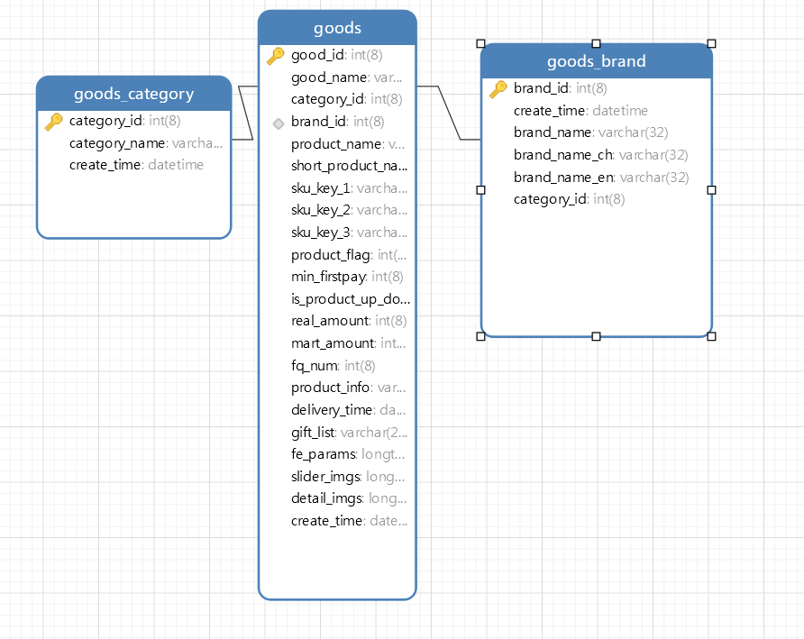

商品相关字段

### 商品种类表

```python
# 商品种类的 id 和对应的名称  category_id_1
category_id   种类 int
category_name  种类名称 str
create_time   创建时间   str
```

### 商品品牌表

```python
品牌id      brand_id int
名称        brand_name str
中文名      brand_name_ch str
英文名      brand_name_en str
大分类id	 category_id_1 int
创建时间     create_time   str
```

### 商品表

```python
商品id  	good_id  str
标题 		good_name  (product_name)    str
商品类别  	category_id   （id_1）  int
商品品牌  	brand_id  int
商品描述	   product_desc  str  需将其中的 "分期乐" 替换
商品简称  	short_product_name str
关键词1 	 sku_key_1  str
关键词2 	 sku_key_2  str
关键词3 	 sku_key_3 str
商品是否有货 	 product_flag   int
最少首付 	 min_firstpay   int
是否降价 	 is_product_up_down	int
现价 	 real_amount	int
原价 	 mart_amount	int
分期 几个月 默认12  	fq_num	int
商品详细介绍 	 product_info str
购买之后 送达时间  	delivery_time str
促销信息 	 gift_list str
包装 售后相关	  	fe_params str
展示商品页轮播图 	 slider_imgs  str "||" 分隔
商品详情的图片 	 detail_imgs str	"||" 分隔
创建时间 		  create_time str
```



### 数据示例

种类品牌示例

```python
种类
categories_dict = {
    66: "手机",
    327: "腕表配饰",
    65: "电脑办公",
    67: "相机单反",
    217: "平板数码",
    179: "运动户外",
    255: "家电家居",
}

品牌
# 关键字段     品牌id      名称           中文名            英文名            大分类id
key_words = ['brand_id', 'brand_name', 'brand_name_ch', 'brand_name_en', 'category_id_1']

# 全部字段 展示
{
	'category_id_list': ['99'],
	'cb_id': '4023', 
	'brand_id': 12, 
	'category_id': 99, 
	'inner_flag': 0, 
	'category_id_3': 0, 
	'brand_name_ch': '小米', 
	'brand_name': '小米（MI）',
	'category_id_2': 99,
	'brand_name_en': 'MI',
	'category_id_1': 66,
	'show_index': 0,
	'create_time': '2013-07-16 23:21:59',
	'modify_time': '2015-04-10 17:56:19'
},

```

商品字段展示

```python
good_id  int 商品id
category_id  int 商品类别 id
brand_id  int 商品品牌 id
slider_imgs  list 展示商品页轮播图 url  
detail_imgs  list 商品详情的图片 url
detail_data  dict  商品的详细信息  具体字段解释如下
{
    "sku_key_1" : "深空灰",   #关键词1
    "sku_key_2" : "64G",   #关键词2
    "sku_key_3" : "全网通",   #关键词3
    "product_name" : "Apple iPhone 8 Plus 国行正品 4G智能手机",    #标题
    "short_product_name" : "",   #商品简称
    "product_desc" : "分期乐为苹果官方授权经销商，百分百正品，值得信赖！",    #商品描述，需将其中的 分期乐 替换
    "product_flag" : "1",  #商品是否有货
    "min_firstpay" : "0",  #最少首付
    "brand_id" : "11",   #商品的 品牌 id
    "is_product_up_down" : 1,  #是否降价
    "amount" : "5799",  # 现价
    "real_amount" : "5799",  #现价
    "mart_amount" : "6399",   #原价
    "fq_num" : 12,  #分期 几个月 默认12
    #计算每月应还款额度
    "mon_pay" : "548.36",  
	#商品详细介绍
    "product_info" : "Apple iPhone 8 Plus 国行正品 4G智能手机 深空灰 64G 全网通",   
    #购买之后 送达时间
    "delivery_time" : "3天之内",  
    # 促销信息
    "gift_list" : [   
        {
            "desc" : "iPhone爆款限时2期免息",
            "name" : "免息",
            "type" : 500
        }
    ],
    #  包装 售后相关
    "fe_params" : {
        "sku_detail_info" : {
            "sku_detail" :  '', #包装清单  table样式 可直接
            "packing_list" : '', #售后保障内容 html 样式
        },
  
    }
        
```

